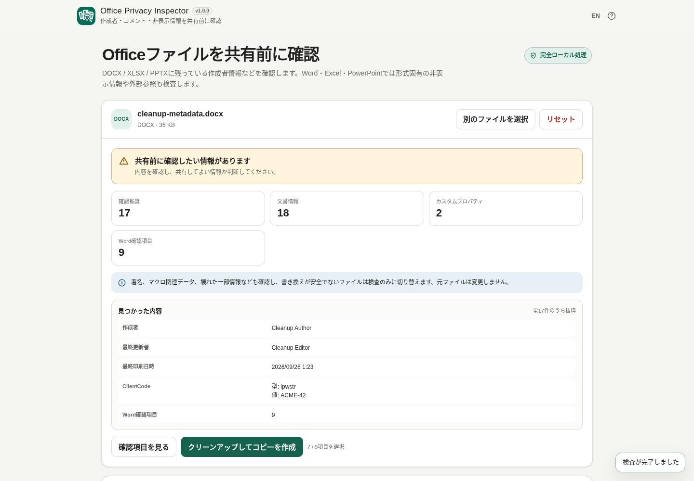

# Office Privacy Inspector

[](https://github.com/ttomohisa/htmlapps-office-privacy-inspector/actions/workflows/deploy-pages.yml)
[](LICENSE)
[](https://ttomohisa.github.io/htmlapps-office-privacy-inspector/)

[English README](README.md)

DOCX / XLSX / PPTX を共有する前に、作成者情報、コメント、非表示情報、外部参照などを確認するための、単一HTMLで動く Browser Kitty ツールです。

Office Privacy Inspector は、見つかった情報を表示し、対応している項目だけをユーザーが選んでクリーンアップし、別ファイルとしてコピーを生成します。生成後はもう一度検査してから保存できます。元ファイルは上書きしません。

## 🚀 デモ

### [GitHub PagesでOffice Privacy Inspectorを開く](https://ttomohisa.github.io/htmlapps-office-privacy-inspector/)

GitHub Pagesから最初のHTMLを読み込んだ後、Officeファイルの読み込み、OOXML検査、クリーンアップ、再検査はブラウザ内で行います。生成版ではCSPにより実行時の外部通信を遮断します。

[](https://ttomohisa.github.io/htmlapps-office-privacy-inspector/)

## Features

- **Officeの基本メタデータを確認** — 作成者、最終更新者、会社名、管理者名、総編集時間、Custom Propertiesなどを表示します。
- **Word固有の情報を確認** — コメント、変更履歴、非表示テキスト、編集セッション情報（RSID）、外部Relationship、埋め込み要素、Custom XMLを検出します。
- **Excel固有の情報を確認** — Hidden / Very Hiddenシート、非表示行列、外部参照、Defined Names、Connections、Pivot / Slicer Cache、埋め込み要素、マクロ関連package情報を検出します。
- **PowerPoint固有の情報を確認** — コメント、発表者ノート、非表示スライド、スライド外オブジェクト、外部Relationship、埋め込み要素、Custom XML、マクロ関連package情報を検出します。
- **概要で実際の内容を確認** — 件数だけでなく、ファイル内で実際に見つかった値や代表的な内容を結果上部に表示します。
- **対応項目だけをクリーンアップ** — 選択したメタデータ、Custom Properties、DOCXのRSID / コメント、PPTXのコメント / 発表者ノートを別コピーから削除できます。
- **生成後に自動で再検査** — Before / Afterの件数と、残っている確認項目を表示します。
- **安全に書き換えられないpackageは検査のみに切替** — デジタル署名、マクロ有効ファイル、Macro / ActiveX関連part、Relationship ID重複、一部解析失敗がある場合はクリーンアップを無効にします。
- **PC / スマートフォン対応** — 日本語 / English、固定クリーンアップ操作、スマホ下部アクションに対応しています。
- **単一HTML配布** — v1.0.0では第三者ランタイムライブラリを同梱せず、実行時CDNも使用しません。

## Quick start

### Webデモを使う

[GitHub Pages版](https://ttomohisa.github.io/htmlapps-office-privacy-inspector/)を開きます。インストールやアカウント登録は不要です。

### 単一HTMLを使う

1. このリポジトリまたはビルド成果物から `dist/index.html` を取得します。
2. 現行のChrome / Edgeで開きます。
3. DOCX / XLSX / PPTXを選択するか、画面へドロップします。

配布用として、より小さいラッパーから起動時にHTMLを展開する `dist/index.self-extract.html` も生成します。

## Usage

1. DOCX / XLSX / PPTXを追加します。DOCM / XLSM / PPTMは検査できますが、クリーンアップは行いません。
2. 概要と **共有前に確認したい情報** を確認します。概要では実際に見つかった値の抜粋も確認できます。
3. Word / Excel / PowerPoint固有の確認項目と「ファイル構造の注意」を確認します。
4. 削除する項目を選択します。一般的な基本メタデータとDOCX RSIDは初期ON、Custom Properties・コメント・発表者ノートは初期OFFです。
5. **クリーンアップしてコピーを作成** を押します。コメント全削除や発表者ノート全削除では、必要に応じて確認ダイアログを表示します。
6. 自動再検査が終わると、画面は **クリーンアップして再検査しました** の結果まで移動します。
7. 削除前 / 削除後、残っている確認項目を確認し、必要なら保存ファイル名を変更してクリーンアップ済みOfficeファイルを保存します。

### 初期選択

| 項目 | 初期状態 | DOCX | XLSX | PPTX |
| --- | --- | ---: | ---: | ---: |
| 作成者 / 最終更新者 / 最終印刷日時 | ON | ✓ | ✓ | ✓ |
| 会社名 / 管理者名 / 総編集時間 | ON | ✓ | ✓ | ✓ |
| 選択したCustom Properties | OFF | ✓ | ✓ | ✓ |
| 編集セッション情報（RSID） | 見つかった場合ON | ✓ | — | — |
| コメント全削除 | OFF | ✓ | — | ✓ |
| 発表者ノート | OFF | — | — | ✓ |

元ファイルは上書きせず、必ず別の `-cleaned` コピーを作成します。

## Supported files

正式対応:

- `.docx`
- `.xlsx`
- `.pptx`

検査のみ:

- `.docm` / `.xlsm` / `.pptm`
- デジタル署名付き DOCX / XLSX / PPTX
- Macro / ActiveX関連partを含む通常OOXML
- Relationship ID重複があるpackage
- 一部解析失敗があるpackage

非対応:

- `.doc` / `.xls` / `.ppt`
- 暗号化 / パスワード保護済みOfficeファイル

## 確認できる項目

| 項目 | DOCX | XLSX | PPTX | v1.0.0で削除 |
| --- | ---: | ---: | ---: | ---: |
| 作成者 / 最終更新者 / 最終印刷日時 | ✓ | ✓ | ✓ | ✓ |
| 会社名 / 管理者名 / 総編集時間 | ✓ | ✓ | ✓ | ✓ |
| Custom Properties | ✓ | ✓ | ✓ | 選択した項目 |
| コメント | ✓ | — | ✓ | DOCX / PPTX |
| 変更履歴 | ✓ | — | — | — |
| 非表示テキスト | ✓ | — | — | — |
| 編集セッション情報（RSID） | ✓ | — | — | ✓ |
| Hidden / Very Hidden Sheet | — | ✓ | — | — |
| Hidden Row / Column | — | ✓ | — | — |
| 外部Relationship | ✓ | ✓ | ✓ | — |
| 外部数式 / Defined Names / Connections | — | ✓ | — | — |
| Pivot / Slicer Cache | — | ✓ | — | — |
| 発表者ノート | — | — | ✓ | ✓ |
| 非表示スライド | — | — | ✓ | — |
| スライド外オブジェクト | — | — | ✓ | — |
| 埋め込み要素 | ✓ | ✓ | ✓ | — |
| Custom XML | ✓ | — | ✓ | — |
| デジタル署名package情報 | ✓ | ✓ | ✓ | 検査のみ |
| Macro / ActiveX関連package情報 | ✓ | ✓ | ✓ | 検査のみ |
| Relationship ID重複 | ✓ | ✓ | ✓ | 検査のみ |
| Optional partの一部解析失敗 | ✓ | ✓ | ✓ | 検査のみ |

## Cleanup behavior

packageの信頼性チェックを通過した場合に、以下を別コピーから削除できます。

- Creator / 作成者
- Last Modified By / 最終更新者
- Last Printed / 最終印刷日時
- Company / 会社名
- Manager / 管理者名
- Total Editing Time / 総編集時間
- 個別に選択したCustom Properties
- DOCXの編集セッション情報（RSID）
- DOCXの全コメント（コメント参照・関連メタデータを含む）
- PPTXの全コメントとコメント作成者情報
- PPTXの発表者ノート（スライド単位 / 全ノート）

変更が必要なXMLだけを再構築します。画像・動画・埋め込みバイナリなど変更しないZIP entryは、検査のために中身をデコードせず保持します。再構築後は生成したpackageを再度解析してから完了結果を表示します。

## GitHub Pagesで公開する

このリポジトリには、単一HTMLをビルドして `dist/` をGitHub Pagesへ公開するworkflowが含まれています。

1. `ttomohisa/htmlapps-office-privacy-inspector` としてGitHubへpushします。
2. **Settings → Pages → Build and deployment → Source** で **GitHub Actions** を選択します。
3. `main` へpushするか、Actionsから **Deploy standalone app to GitHub Pages** を実行します。
4. 成功後、`https://ttomohisa.github.io/htmlapps-office-privacy-inspector/` で利用できます。

公開前にテンプレートのrepository checkを実行し、通常の単一HTMLとself-extract版の成果物も生成します。

## Development / Build

```text
.
├─ src/index.template.html       # アプリの編集元
├─ assets/
│  ├─ favicon.svg                # favicon / 左上アイコン共通
│  ├─ screenshot.png             # 日本語スクリーンショット
│  └─ screenshot-en.png          # 英語スクリーンショット
├─ tests/fixtures/               # OOXML回帰fixture
├─ app.config.json               # アプリ情報・バージョン
├─ dependencies.json             # ランタイム依存宣言（v1.0.0は空）
├─ build-standalone.bat          # Windowsビルド入口
├─ build-standalone.ps1          # 単一HTMLビルダー
└─ dist/
   ├─ index.html
   └─ index.self-extract.html
```

Windows 10 / 11:

```bat
build-standalone.bat
```

ビルドではfavicon / 左上アイコンの埋め込み、単一HTML検証、未解決placeholder確認、self-extract版、各manifestを生成します。

`dist/index.html` は直接編集せず、`src/index.template.html` を変更して再ビルドします。

## Privacy

生成済み単一HTMLは `connect-src 'none'` を含むContent Security Policyを使用します。実行時にCDN、外部フォント、analytics、telemetryを読み込みません。

Office ZIPの検査には `FileReader`、`DecompressionStream`、`DOMParser`、`CompressionStream`、`Blob` などのブラウザ標準APIを利用します。大容量packageでも、存在確認のためだけに画像や埋め込みバイナリをデコードしません。

GitHub Pages版は最初のページ取得には通信が必要です。ネットワークなしで使う場合は生成済み `dist/index.html` をローカルで開いてください。

## Limitations

- 「今回の検査項目では該当なし」と表示されても、ファイル内に機密情報が存在しないことを保証しません。本文、画像、図形、グラフ、白文字、画像内の文字などは別途確認してください。
- 変更履歴、非表示テキスト、非表示シート / 行列、外部参照、埋め込み要素、Custom XMLはv1.0.0では自動削除しません。
- Excelコメント / threaded commentsはv1.0.0では詳細な解析・クリーンアップ対象ではありません。
- VBA / Macroとデジタル署名は書き換えません。検出したpackageは検査のみになります。
- Wordの複雑なスタイル / テーマ継承によるすべての非表示表現を完全にはモデル化していません。
- 暗号化 / パスワード保護済みOOXMLと旧形式 DOC / XLS / PPTには対応していません。
- 大容量Officeファイルは端末のブラウザメモリ上限によって処理できない場合があります。
- XML解析は現在メインスレッドで行います。長い走査では協調yieldを行い、別ファイル選択やリセット時には古い読み込みをキャンセルします。

## Dependencies

Office Privacy Inspector v1.0.0 は、**第三者ランタイムライブラリを同梱していません**。OOXML ZIP / XML処理はブラウザ標準APIで行います。

詳細は [THIRD_PARTY_NOTICES.md](THIRD_PARTY_NOTICES.md) を参照してください。

## Contributing

不具合報告・機能提案はGitHub Issuesで受け付けます。開発時のルールは [CONTRIBUTING.md](CONTRIBUTING.md) を参照してください。

## License

Copyright © 2026 ttomohisa

[MIT License](LICENSE)


## 件数のみの検査サマリー

検査後に「検査サマリーを保存 (.json)」を選ぶと、ローカルでJSONを保存できます。初期ファイル名は元の文書名と無関係な `inspection-summary.json` で、保存前に編集できます。スキーマ・アプリのバージョン、検出形式、対応項目の検査状況、カテゴリ別件数、クリーンアップ制限を含み、クリーンアップ後の再検査が成功した場合は削除前後の件数も保存します。

元のファイル名、作成者名、プロパティ名・値、コメントやノートの本文、パス、URL、エラー詳細は含めません。アプリへの保存やサーバー送信はありません。一部未検査の場合、カテゴリ別件数は `null`（不明）です。対象外や未対応のカテゴリも `null` で表し、0件とは区別します。再検査に失敗した場合は削除後の件数を含めません。件数は対応項目での検出数であり、文書全体の内容を網羅しません。0件でも安全・匿名の保証にはならず、共有前にサマリーのファイル名と件数も確認してください。

「検査完了」は実装済みの検査項目の状況を示し、OOXML構造全体の検証を意味しません。参照先のワークシートやスライドの欠落は網羅的には検証しません。必須のWord文書パーツが欠落した場合は一部未検査として扱い、クリーンアップを無効にします。

ZIP内で正規化後の項目名が重複するファイル（スラッシュとバックスラッシュの衝突を含む）は、検査やクリーンアップの前に拒否します。重複項目から一つを選んで処理することはありません。
