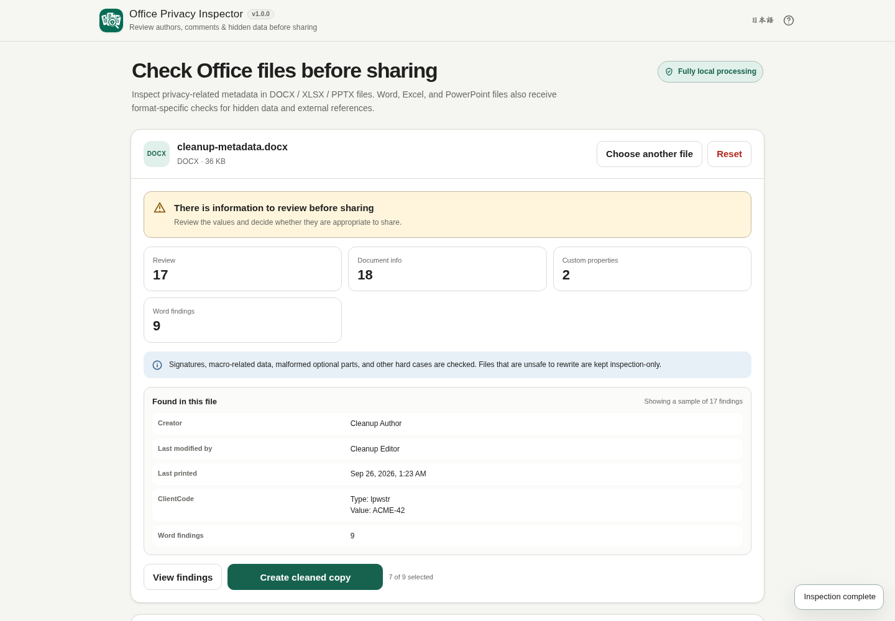

# Office Privacy Inspector

[](https://github.com/ttomohisa/htmlapps-office-privacy-inspector/actions/workflows/deploy-pages.yml)
[](LICENSE)
[](https://ttomohisa.github.io/htmlapps-office-privacy-inspector/)

[日本語版 README](README.ja.md)

A privacy-focused, single-HTML app for inspecting metadata, comments, hidden information, external references, and other review items in DOCX / XLSX / PPTX files before sharing them.

Office Privacy Inspector shows what it found, lets you select only supported cleanup targets, creates a separate cleaned copy, and reinspects that copy before you save it. The original Office file is never overwritten.

## 🚀 Live demo

### [Open Office Privacy Inspector on GitHub Pages](https://ttomohisa.github.io/htmlapps-office-privacy-inspector/)

GitHub Pages serves the initial HTML. File reading, OOXML inspection, cleanup, and reinspection run in the browser. Runtime network connections are blocked by the generated app's Content Security Policy.

[](https://ttomohisa.github.io/htmlapps-office-privacy-inspector/)

## Features

- **Inspect common Office metadata** — Review Creator, Last Modified By, Company, Manager, editing time, Custom Properties, and other Core / Extended Properties.
- **Check Word-specific information** — Find comments, tracked changes, hidden text, editing-session identifiers (RSID), external relationships, embedded objects, and Custom XML.
- **Check Excel-specific information** — Find Hidden / Very Hidden sheets, hidden rows and columns, external references, defined names, connections, Pivot / Slicer caches, embedded objects, and macro-related package data.
- **Check PowerPoint-specific information** — Find comments, speaker notes, hidden slides, off-slide objects, external relationships, embedded objects, Custom XML, and macro-related package data.
- **See actual findings near the summary** — The result summary includes representative values and previews instead of showing counts alone.
- **Clean only supported items** — Remove selected metadata, selected Custom Properties, DOCX RSID/comments, and PPTX comments/speaker notes into a new copy.
- **Reinspect automatically** — After cleanup, compare Before / After finding counts and review anything that remains.
- **Keep risky packages inspection-only** — Digital signatures, macro-enabled packages, macro / ActiveX-related parts, duplicate Relationship IDs, and partial inspection failures disable cleanup instead of being treated as safe to rewrite.
- **Use it on desktop or mobile** — Japanese / English UI, responsive result layout, sticky cleanup controls, and mobile bottom actions are included.
- **Single-HTML distribution** — No third-party runtime library is bundled and no runtime CDN is required.

## Quick start

### Use the web demo

Open the [GitHub Pages demo](https://ttomohisa.github.io/htmlapps-office-privacy-inspector/). No installation or account is required.

### Use the standalone HTML

1. Download `dist/index.html` from this repository or from a build artifact.
2. Open the file in a current Chrome or Edge browser.
3. Choose a DOCX / XLSX / PPTX file or drag it onto the page.

The self-extracting `dist/index.self-extract.html` is also generated for distribution when a smaller wrapper file is useful.

## Usage

1. Add a DOCX / XLSX / PPTX file. DOCM / XLSM / PPTM can be inspected but are kept inspection-only.
2. Review the summary and the **Information to review before sharing** section. The summary shows representative values from the file.
3. Review Word / Excel / PowerPoint-specific findings and any package cautions.
4. Select cleanup targets. Common safer metadata and DOCX RSID start selected; Custom Properties, comments, and speaker notes start unselected.
5. Choose **Create cleaned copy**. Comment or remove-all-notes operations ask for confirmation when appropriate.
6. Wait for automatic reinspection. When it finishes, the page moves to the **Cleanup and reinspection complete** result.
7. Compare Before / After counts, review remaining findings, edit the output filename if needed, and save the cleaned Office file.

### Cleanup defaults

| Item | Default | DOCX | XLSX | PPTX |
| --- | --- | ---: | ---: | ---: |
| Creator / Last Modified By / Last Printed | On | ✓ | ✓ | ✓ |
| Company / Manager / Total Editing Time | On | ✓ | ✓ | ✓ |
| Selected Custom Properties | Off | ✓ | ✓ | ✓ |
| Editing session information (RSID) | On when found | ✓ | — | — |
| All comments | Off | ✓ | — | ✓ |
| Speaker notes | Off | — | — | ✓ |

The app always creates a separate `-cleaned` copy. It does not overwrite the original file.

## Supported files

Fully supported:

- `.docx`
- `.xlsx`
- `.pptx`

Inspection-only:

- `.docm` / `.xlsm` / `.pptm`
- Signed DOCX / XLSX / PPTX packages
- Normal OOXML packages containing macro / ActiveX-related parts
- Packages with duplicate Relationship IDs
- Packages with partial inspection failures

Not supported:

- `.doc` / `.xls` / `.ppt`
- Encrypted or password-protected Office files

## What it checks

| Finding | DOCX | XLSX | PPTX | Cleanup in v1.0.0 |
| --- | ---: | ---: | ---: | ---: |
| Creator / Last Modified By / Last Printed | ✓ | ✓ | ✓ | ✓ |
| Company / Manager / Total Editing Time | ✓ | ✓ | ✓ | ✓ |
| Custom Properties | ✓ | ✓ | ✓ | Selected only |
| Comments | ✓ | — | ✓ | DOCX / PPTX |
| Tracked changes | ✓ | — | — | — |
| Hidden text | ✓ | — | — | — |
| Editing session information (RSID) | ✓ | — | — | ✓ |
| Hidden / Very Hidden sheets | — | ✓ | — | — |
| Hidden rows / columns | — | ✓ | — | — |
| External relationships | ✓ | ✓ | ✓ | — |
| External formulas / defined names / connections | — | ✓ | — | — |
| Pivot / Slicer caches | — | ✓ | — | — |
| Speaker notes | — | — | ✓ | ✓ |
| Hidden slides | — | — | ✓ | — |
| Off-slide objects | — | — | ✓ | — |
| Embedded objects | ✓ | ✓ | ✓ | — |
| Custom XML | ✓ | — | ✓ | — |
| Digital signature package data | ✓ | ✓ | ✓ | Inspection only |
| Macro / ActiveX-related package data | ✓ | ✓ | ✓ | Inspection only |
| Duplicate Relationship IDs | ✓ | ✓ | ✓ | Inspection only |
| Partial optional-part inspection failures | ✓ | ✓ | ✓ | Inspection only |

## Cleanup behavior

Cleanup is enabled only when the package passes the app's reliability checks. Supported cleanup targets are:

- Creator
- Last Modified By
- Last Printed
- Company
- Manager
- Total Editing Time
- Individually selected Custom Properties
- DOCX editing-session identifiers (RSID)
- All DOCX comments, including references and related comment metadata
- All PPTX comments and comment-author metadata
- PPTX speaker notes for selected slides or all note slides

Only XML parts that need to change are rebuilt. Unchanged ZIP entries, including media and embedded binary files, are carried over without decoding their contents for inspection. After rebuilding, the generated package is parsed again before the completion result is shown.

## Publish with GitHub Pages

The repository includes a workflow that builds the standalone HTML and deploys `dist/` to GitHub Pages.

1. Push the repository to GitHub as `ttomohisa/htmlapps-office-privacy-inspector`.
2. Open **Settings → Pages → Build and deployment → Source** and choose **GitHub Actions**.
3. Push to `main`, or manually run **Deploy standalone app to GitHub Pages** from the Actions tab.
4. After deployment, the app is available at `https://ttomohisa.github.io/htmlapps-office-privacy-inspector/`.

The workflow runs the template repository checks before deployment and publishes both the readable standalone HTML and the self-extracting build artifacts.

## Development and build layout

```text
.
├─ src/index.template.html       # Application source template
├─ assets/
│  ├─ favicon.svg                # Canonical app / favicon icon
│  ├─ screenshot.png             # Japanese screenshot
│  └─ screenshot-en.png          # English screenshot
├─ tests/fixtures/               # Synthetic OOXML regression fixtures
├─ app.config.json               # App metadata and version
├─ dependencies.json             # Runtime dependency declaration (empty in v1.0.0)
├─ build-standalone.bat          # Windows build entry point
├─ build-standalone.ps1          # Standalone HTML builder
└─ dist/
   ├─ index.html
   └─ index.self-extract.html
```

### Build

On Windows 10 / 11:

```bat
build-standalone.bat
```

The build embeds the canonical SVG icon, validates the standalone HTML, blocks unresolved placeholders, generates the self-extracting build, and produces build / dependency manifests.

Do not edit `dist/index.html` directly. Edit `src/index.template.html` and rebuild.

## Privacy and runtime network protection

The generated standalone HTML uses a Content Security Policy with `connect-src 'none'`. The app does not load a CDN, remote font, analytics SDK, or telemetry client at runtime.

Office ZIP inspection uses browser APIs such as `FileReader`, `DecompressionStream`, `DOMParser`, `CompressionStream`, `Blob`, and object URLs. For large packages, media and embedded binaries are not decoded merely to detect their presence.

A GitHub Pages visit still requires the initial page request. To use the app without a network connection, open the generated `dist/index.html` locally.

## Limitations

- A clean inspection result does **not** guarantee that the file contains no confidential information. Review visible document text, images, shapes, charts, white text, and image-contained text separately.
- Tracked changes, hidden text, hidden sheets / rows / columns, external references, embedded objects, and Custom XML are detected but not automatically removed in v1.0.0.
- Excel comments / threaded comments are not deeply inspected or cleaned in v1.0.0.
- VBA / macro content and digital signatures are never rewritten; affected packages are inspection-only.
- Complex Word style / theme interactions can contain hidden behavior that the current hidden-text inspection does not fully model.
- Encrypted / password-protected OOXML files and legacy DOC / XLS / PPT formats are not supported.
- Large Office packages can exceed browser memory limits depending on the device.
- The current XML inspection remains on the main thread. Long scans use cooperative yielding and stale reads are cancelled when a new file is selected or the inspection is reset.

## Dependencies

Office Privacy Inspector v1.0.0 bundles **no third-party runtime library code**. OOXML ZIP and XML handling use browser-native Web Platform APIs.

See [THIRD_PARTY_NOTICES.md](THIRD_PARTY_NOTICES.md) for details.

## Contributing

Bug reports and feature proposals are welcome through GitHub Issues. See [CONTRIBUTING.md](CONTRIBUTING.md) for development guidance.

## License

Copyright © 2026 ttomohisa

Licensed under the [MIT License](LICENSE).
